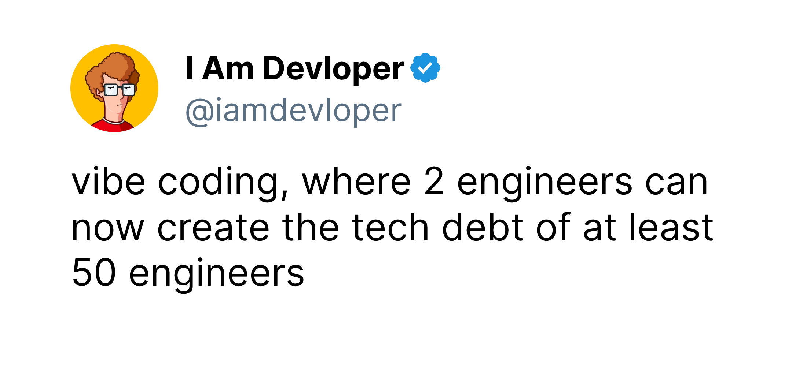
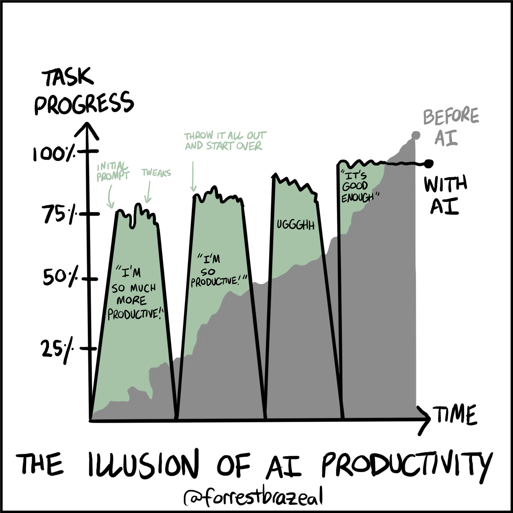
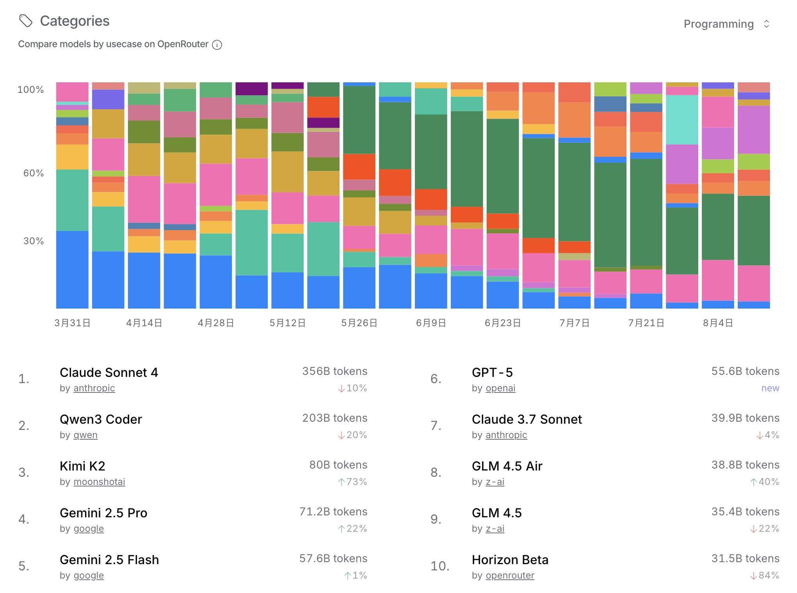
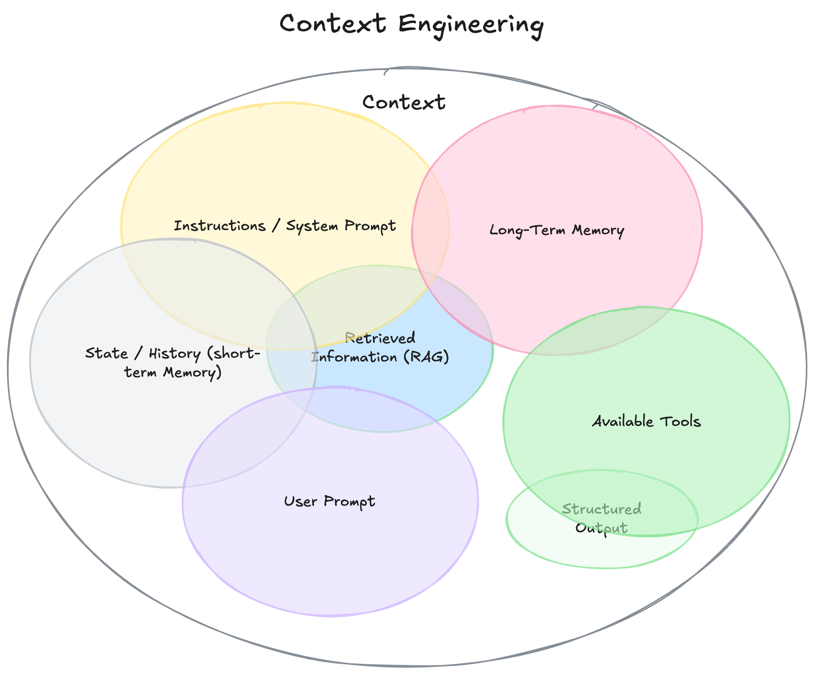
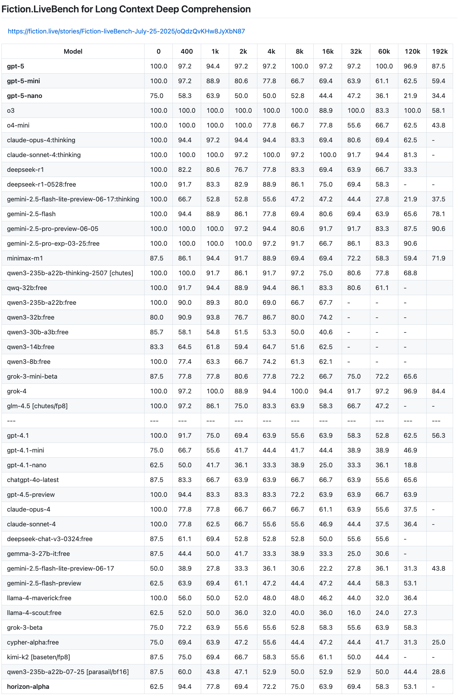

**Vibe Coding 指南**

**工具介绍**

**Terminal 命令行工具**

|  |
| --- |
| 好处：不会和用户编辑操作冲突 |

|  |  |
| --- | --- |
| 工具 | 特性 |
| **Claude-code** | 上下文工程最强 Claude-code-router 第三方接口接入 |
| **Qwen-code** | 支持阿里通义千问模型，每日免费调用 2000 次（via qwen.ai） |
| **Gemini-cli** | Google Gemini 驱动的命令行工具 |
| **Cursor-cli** | Cursor 官方 CLI |

**IDE**

|  |
| --- |
| *推荐：****Cursor****（当前综合体验最佳）* |

|  |  |
| --- | --- |
| Cursor | 基于 VS Code 的 AI 原生 IDE，支持 Ask/Chat、Edit/Code、Agent 等多种模式，智能补全体验强 |
| Windsurf |  |
| Kiro (spec) | 侧重于需求规格生成与代码规划的 AI IDE |
| Trae | 字节产品 对标 Cursor |

**IDE 插件**

|  |  |  |
| --- | --- | --- |
| 插件 | 支持平台 | 特性 |
| **Roo Code** | VS Code | 功能全面，开源，支持各种 API |
| **Continue** | VS Code / JetBrains | 开源 |
| **Cline** | 多平台 |  |
| **GitHub Copilot** | VS Code / JetBrains | 成熟稳定，补全能力较强，闭源 |

|  |  |
| --- | --- |
| ***注意****：人工修改文件后，部分插件需重新加载上下文，可能导致同步问题。建议：*   |  | | --- | | * 修改后手动刷新或通知 AI 重新读取 * 避免频繁切换“人写”与“AI 写”状态 | |

**计费与使用策略**

|  |  |  |  |
| --- | --- | --- | --- |
| 类型 | 免费版 | Pro 会员 | Max 会员 |
| 模型权限 | 限流 + 上下文限制 + 无法使用高级模型 | 普通模型无限制，高级模型限量 | 高级模型无限使用，达量降速 |
| API 限制 | 严格限流 | 较宽松 | 动态限速 |
| 计费逻辑 | - | 订阅制 + 高级功能额外计费 | 订阅制为主 |

**Coding 模式**

**不同模式的区别主要是 prompt 的区别**

|  |  |  |
| --- | --- | --- |
| 模式 | 适用场景 | 说明 |
| **Code Mode** | 小型功能开发、快速补全 | 分为 Ask/Chat（理解逻辑）和 Edit/Code（直接生成代码） |
| **Agent 模式** | 复杂需求开发 | 输入需求 → AI 列出 TODO → 自动调用工具（如 git、测试、shell）逐步实现 |
| **Plan Mode / Spec** | 需求不明确时 | 先规划再编码，通过多轮对话澄清需求，避免误解 |
| **Autocomplete** | 实时编码辅助 | 预测下一行输入，Tap 填充，**Cursor 当前表现最优** |

|  |
| --- |
| *最佳实践：****先 Plan 再 Code****，尤其适用于跨模块、高复杂度任务。* |

**AI Agent**

|  |  |
| --- | --- |
| 组件 | 功能说明 |
| **LLM 核心** | 提供语言理解与生成能力 |
| **调度/编排系统** | 协调多个步骤与工具调用 |
| **Function Call (MCP)** | 调用外部函数（如 API、CLI、数据库） |
| **RAG + 记忆机制** | 检索项目文档、历史记录，增强上下文准确性 |
| **多模态感知** | 支持图像、截图输入（如 UI 设计图 → 代码） |
| **Workflow 引擎** | 实现“探索 → 计划 → 编码 → 提交”闭环 |

|  |
| --- |
| **示例流程**   * 探索，计划，编码，提交 * 编写测试，提交，编码，迭代，提交 * 编写代码，截图，迭代 |

**模型**

**API类型**

|  |  |  |  |
| --- | --- | --- | --- |
|  | 本地模型 | 厂商 API | 插件内置 API |
| 模型 | 开源 | 开源/闭源，开源模型原厂一般有优化 | 会根据任务动态选择模型 |
| 模型大小 | 家用平台 30b，专业卡 70b，越大速度越慢  精度一般比较小 | 满血 | 同左 |
| 速度 | 慢 | 快 | 快->慢，达量降速 |
|  |  |  | 模型降智 |
| 计费规则 | 显卡成本 | Token计费 | 订阅 / 额外API计费 |
| 优点 | 私有部署 | 高性能 | 便宜 |
| 缺点 | 小型开源模型性能有限 | 高费用 | 速度/限流 |
|  |  |  |  |

|  |
| --- |
| 最理想的形式就是 工具和模型都是同一家，方便定向优化  Claude-code qwen-code gemini-cli |

|  |  |  |
| --- | --- | --- |
| 通用模型 | 代码能力优化的模型 | 本地部署推荐 |
| * Qwen3 * Deepseek * Gemini-2.5-pro * GPT 4 / 5 * gemma3 * Llama 3.1 / 4 * Grok 4 | * Qwen3-coder * qwen3-coder-plus * Claude * claude-4 * Kimi-k2 * 函数调用优化 | * unsloth/Qwen3-Coder-30B-A3B-Instruct-GGUF * 注意修复函数调用 * Qwen/Qwen2.5-Coder-1.5B-Instruct * autocomplete * Qwen/QwQ-32B * google/gemma-3-27b-it * meta-llama/Llama-3.1-8B-Instruct |

**运行框架**

|  |  |  |
| --- | --- | --- |
| Ollama | llama.cpp | vllm |
| 简单好用，性能一般，封装llama.cpp | 更多功能，编译麻烦 | 高性能，适用于生产环境 |

**参数/体验**

|  |  |  |
| --- | --- | --- |
|  | 示例 | 参数含义 |
| 模型大小 | 7B 32B 70B 768B | 模型参数量的总数量 参数越大越强大，也消耗更多性能 |
| Quantization | FP16 INT4 | 减少模型体积和运行能能，降低精度 |
| Context Length | 64k 128k | 越长上下文越适合长文本处理（如文档、代码 |
| capability | 理解、推理、生成、代码 | 受训练数据、架构、参数量 |
| 多模态 | 图像，视频输入输出 | 可以根据图片设计UI |
| thinking | 思维链 Reason | 自己完善 prompt，提高结果准确性 |
| 训练规模 | 1T, 3T, 10T tokens | 模型质量 |

**使用评价**

* 速度
* 实用性：上下文空间
* 准确率
* 召回
* 函数调用

**模型相关网站**

* https://ollama.com/library
* https://huggingface.co/
* https://openrouter.ai/

**Thinking / Non-Thinking(Instruct)**

|  |  |  |
| --- | --- | --- |
| 类型 | **Thinking 模型** | **Non-Thinking 模型** |
| 别名 | Reasoning model / CoT model / Deep-thinking model | Instruct model / Fast-response model |
| 特点 | 能够进行**多步推理、逻辑分析、逐步思考（Chain-of-Thought）**，适合**复杂任务** | 快速生成答案，不做深入推理，适合**简单问答**、指令执行 |
| 首token | 有效Token慢，思考过程内Token不可考 | 快 |
| Token 消耗 | 多，额外的ThinkingToken | 较少 |
| 提示词 | 可以简单些 | 最好写详细点 |
|  |  |  |

|  |
| --- |
| * 复杂任务 → 使用 Thinking 模型（如 Qwen3-Coder-Plus） * 日常补全 → 使用 Instruct 模型（如 Llama3.1-8B-Instruct） |

**Function Call 与 MCP**

尽管各家 API 格式不同，但本质是**解析序列化输入输出**。

* 主流训练格式 ≠ JSON（可能导致格式错误）
* 推荐使用模型训练时最常用的格式（如 Anthropic 的工具调用规范）
* 注意修复函数调用中的 schema 错误与参数类型问题

|  |
| --- |
| *🔧 提示：优先选择支持 MCP（Model Control Protocol）的平台，提升工具调用可靠性。* |

**提示词工程 → 上下文工程**

**提示词工程（Prompt Engineering）**

* **激发**模型潜力（Cosplay）
* 提示词/交互/对接/调优
* 角色 + 任务
* 指令
* 上下文
* 输入数据
* 输出提示

**上下文工程（Context Engineering）**

1. 信息收集和整合：从多源数据中获取与任务高度相关的内容
2. 结构化和格式化：将信息结构化组织，按照一定格式提供给大模型
3. 上下文管理：在有限的上下文窗口内，通过裁剪、隔离、压缩、持久化等手段来管理
4. 工具和外部系统接入：通过与外部工具和系统交互，增强模型的能力

|  |
| --- |
| *核心思想：****把最重要的信息放在有限的上下文窗口中*** |

**问题：正确的代码编程是个概率事件**

* 幻觉 - RAG - 文档索引 微调，训练集丰富程度的差异直接决定了模型在不同领域的表现
* 实时反馈的错误修正
* 召回 - 准确率 - 漏掉内容

[Fiction.liveBench](https://fiction.live/stories/Fiction-liveBench-Mar-25-2025/oQdzQvKHw8JyXbN87)

|  |  |  |
| --- | --- | --- |
| 问题 | 后果 | 应对措施 |
| **生成一大坨代码** | 超出上下文召回能力 | 单文件 ≤500 行，拆分任务 |
| **滥用全局变量** | 降低可维护性 | 在 Prompt 中明确禁止，配合 lint 检查 |
| **代码 Clone + 忘删原版** | 冗余、潜在 bug | 要求“重写而非修改” |
| **注释过多或不符** | 浪费上下文，误导 | 要求“简洁必要注释”，人工同步时及时清理 |
| **资源未释放** | OOM、连接泄漏 | 人工复查 + 多模型交叉验证 |
| **Mock 实现（if true return mock）** | 表面通过实则未实现 | 使用 #TODO 标记 + 测试驱动开发 |
| **知识/代码不准确** | 产生幻觉 | 结合 RAG、微调、文档索引 |
| **性能低下** | 使用低效算法 | 压测 + 人工优化 + 更优模型 |
| **风格混乱** | 维护困难 | 固定代码风格模板 + lint + 示例代码引导 |
| **使用老旧框架** | 安全隐患 | 使用更新模型 + 明确技术栈约束 |

|  |
| --- |
| ***核心原则****：*   * **AI 写代码时，人不要中途干预**；若要改，应由人全权负责重构 * **人工修改后必须同步上下文**，否则 AI 会“看不懂” |

**最佳实践（Tips）**

**开发流程优化**

* ✅ **TDD（测试驱动开发）**：先写测试 → AI 实现 → 不通过则迭代
* ✅ **小步迭代**：将大任务拆分为子任务（每个任务独立 session）
* ✅ **生成任务计划**：用 Markdown 记录开发路径，供后续任务读取
* ✅ **控制任务大小**：确保上下文充足，避免压缩丢失细节
* ✅ **新开任务总结承接**：当前任务结束前，让 AI 总结成果传递给下一阶段

**工具与模型策略**

* ✅ **不吝啬 Context 与 Token**：在合理范围内尽量提供完整上下文
* ✅ **Code Index**：建立项目索引（文件结构、关键类、接口定义），提升 AI 理解力
* ✅ **针对任务定制 Prompt/Agent**：不同任务使用不同 agent 模板
* ✅ **使用训练语言交流**：尽量用模型训练时的主要语言（如英文）提问
* ✅ **固定工具链**：选择 2–3 个主力工具，避免频繁切换导致风格不一

**质量保障**

* ✅ **规范代码风格**：统一缩进、命名、注释风格
* ✅ **版本管理**：Git 分支清晰，PR 必须附带 commit message
* ✅ **Code Review**：AI 生成代码必须经过人工审查
* ✅ **编写文档**：自动或手动生成 API 文档、使用说明
